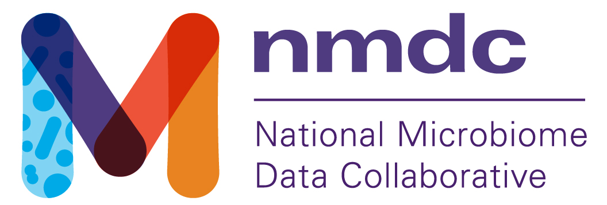
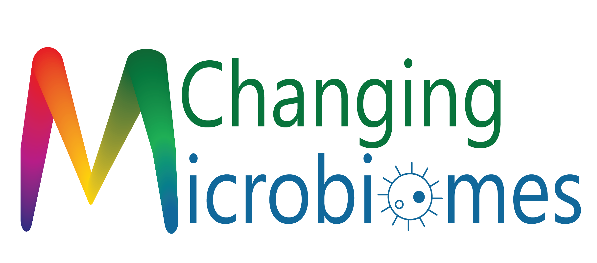
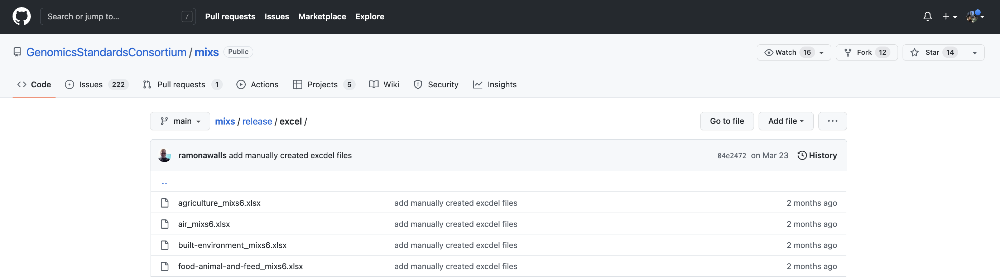
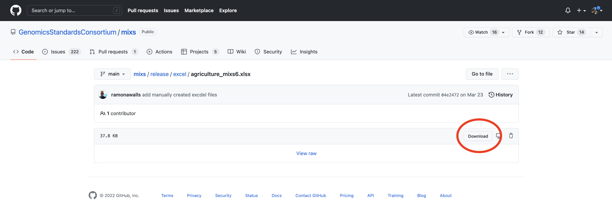

	
	

# Changing Microbiomes 2022 NMDC Metadata Standards Workshop

## Details
May 31st, 2022  
Time: 1pm - 2:50pm  
Instructors: Emily Davenport (NMDC Ambassador), Julia Kelliher (NMDC)

## Description

Collecting, storing, and sharing data that are findable, accessible, interoperable, and reusable (FAIR) is an important challenge across microbiome fields. 
In this workshop hosted by the [National Microbiome Data Collaborative (NMDC)](https://microbiomedata.org/), participants will learn about metadata standards, how to plan data collection in their own projects to adhere to these standards, how to share their data with the community, and how to find and use publicly available microbiome data.

## Resources  

Here are a list of resources for the workshop:  
- [Presentation](files/presentation.pdf)  
- [Activity](https://docs.google.com/document/d/1PGyZSmPxes70XrPrpWvMo-Digiqn85cLmy8BcFsGyIY/edit?usp=sharing)  
- [Example case study (human)](https://docs.google.com/document/d/1ODVR45AnqYu8DAYGbRuO2icHikDxGJVOTNWhG6FXCZM/edit?usp=sharing) | [Example case study (soil)](https://docs.google.com/document/d/1bwrTQSanenNJO69NQGwsWkBdp3mWAHYvOE_fx-OPYpw/edit?usp=sharing)  
- [Post-event survey](https://bit.ly/PSUNMDC)  
- [MIxS packages](https://github.com/GenomicsStandardsConsortium/mixs/tree/main/release/excel)  
To download, click on the package that corresponds to your environment in the GitHub repository:  

Then click on the download button to download an excel file explaining the fields in that package:  

